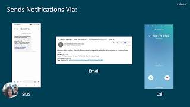

# War Room Assistant Bot

Welcome to our WXSD DEMO Repo! <!-- Keep this here -->

War room assistant bot also known as Hanna Bot is designed to help with incident response workflows. It reduces incident response time, raises incident awareness, reduces time to resolution and provides simplified access to Incident Management workflows through Webex. It is a proof-of-concept to illustrate the flexibility of Webex programmable capabilities available.

<p align="center">
   <a href="https://www.youtube.com/watch?v=kjve61ZexiQ&t=1s" target="_blank">
       
    </a>
</p>

## Table of Contents

<!-- ⛔️ MD-MAGIC-EXAMPLE:START (TOC:collapse=true&collapseText=Click to expand) -->
<details>
<summary>(click to expand)</summary>
    
  * [Overview](#overview)
  * [Usage](#usage)
  * [Setup](#setup)
  * [Installation](#installation)
  * [Demo](#demo)
  * [License](#license)  
  * [Disclaimer](#disclaimer)
  * [Questions](#questions)

</details>
<!-- ⛔️ MD-MAGIC-EXAMPLE:END -->
 
## Overview

On sending a message to the bot, it replies with an adaptive card which requires you to fill in the incident ID(optional), select the incident scenario(required) and add any additional notes to be sent in the space(optional). On submitting the information a new space will be created with all the required members and an initial message with the incident ID, scenario, message, notes and meeting link will be sent in the space created. It also sends a PSTN call to all the members asking them to check thier SMS and email for the meeting link if they are away from thier webex client. As said it sends information like incident ID, scenario, message, additional notes and meeting link through SMS and email to all the participants. Participants can join the meeting using the meeting link sent without downloading the client on thier device.

This war room assistant bot PoC currently uses MongoDb for storing data like contacts, member data etc (Refer MongoDB schema section for setting up your DB). It also uses Webex javascript SDK for messaging and meeting workloads and for WebRTC client-less meeting joining. It uses webex Connect for PSTN dial out and SMS messaging capabilitites. For sending out emails, it uses AWS mail relay services.

## Usage

1. Send a direct message to the bot created.
2. Bot sends a card, in which you can add your incident ID (optional), select scenario type(required) and also send an additional message(optional)
3. Then click on "Go!" button.
4. A new space creates with the members specified and also sends a SMS message, email and call notifying the members in the group about the incident.

## Setup

### Prerequisites & Dependencies:

- Valid bot access token. Please refer [Webex Developer Site](https://developer.webex.com/docs/bots#creating-a-webex-bot) to see how to create a bot and access token.
- Developed on Windows 11
- MongoDb (i.e Atlas)
- Node >18.15.0 (recommended)
- Other OS and node versions may work but not tested

You will need to create a file called **.env** that includes the following lines:

```
PORT=
WEBEX_LOG_LEVEL=debug
WEBEX_ACCESS_TOKEN=
MONGO_URI=
MONGO_DB=hannah
ERROR_ROOM_ID=
IMI_PHONE_URL=

```

Note:

1. You will need to provide a port for this to run locally
2. You will need to provide an access_token of a test bot for testing
3. You will need to provide a roomId for error messages to be sent. This can be any Webex Space roomId that your bot is a member of.
4. Please use the Mongo credentials shown above in the .env file
5. Please feel free to add or delete members object in the DB to add or remove members.

## Installation

The typical npm install flow, after cloning this repo

```
npm init
npm install
npm start
```

## Demo

<!-- Insert link to the website below (if deployed). -->

Check out our live demo, available [here](https://www.youtube.com/watch?v=kjve61ZexiQ&t=1s)!

<!-- Keep the following statement -->

\*For more demos & PoCs like this, check out our [Webex Labs site](https://collabtoolbox.cisco.com/webex-labs).

## License

<!-- MAKE SURE an MIT license is included in your Repository. If another license is needed, verify with management. This is for legal reasons.-->

<!-- Keep the following statement -->

All contents are licensed under the MIT license. Please see [license](LICENSE) for details.

## Disclaimer

<!-- Keep the following here -->

Everything included is for demo and Proof of Concept purposes only. Use of the site is solely at your own risk. This site may contain links to third party content, which we do not warrant, endorse, or assume liability for. These demos are for Cisco Webex usecases, but are not Official Cisco Webex Branded demos.

## Questions

Please contact the WXSD team at [wxsd@external.cisco.com](mailto:wxsd@external.cisco.com?subject=war-room-assistant-bot) for questions. Or, if you're a Cisco internal employee, reach out to us on the Webex App via our bot (globalexpert@webex.bot). In the "Engagement Type" field, choose the "API/SDK Proof of Concept Integration Development" option to make sure you reach our team.
